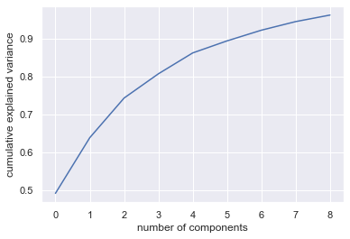

# Multivariate Statistical Data Analysis

## Contents
- [Multivariate Statistical Data Analysis](#multivariate-statistical-data-analysis)
  - [Contents](#contents)
  - [Problem 1](#problem-1)
    - [Solving Problem 1](#solving-problem-1)
      - [a. Income ve education değişkenlerinin histogramlarını çizin. Histogramlar çift modlu mu yoksa tek modlu mu(bimodal or unimodal)? Eğik(skewed) mi, değil mi? Histogramın şeklini yorumlayınız.](#a-income-ve-education-değişkenlerinin-histogramlarını-çizin-histogramlar-çift-modlu-mu-yoksa-tek-modlu-mubimodal-or-unimodal-eğikskewed-mi-değil-mi-histogramın-şeklini-yorumlayınız)
      - [b. Sales değişkeni için ortalama, medyan, varyans ve standart sapma ölçümlerini ve değişkenler arasındaki covaryansı hesaplayınız.](#b-sales-değişkeni-için-ortalama-medyan-varyans-ve-standart-sapma-ölçümlerini-ve-değişkenler-arasındaki-covaryansı-hesaplayınız)
      - [c. Ages değişkeni için 10, 25, 75, 90 niceliklerini hesaplayınız.](#c-ages-değişkeni-için-10-25-75-90-niceliklerini-hesaplayınız)
      - [d. Tüm değişkenleri özetlemek için betimleyici istatistik bilgilerini hesaplayınız.](#d-tüm-değişkenleri-özetlemek-için-betimleyici-istatistik-bilgilerini-hesaplayınız)
  - [Problem 2](#problem-2)
    - [Solving Problem 2](#solving-problem-2)
      - [a. *capital-gain* için histogram grafiği çizin. Grafiğin şekli hakkında yorum yapınız.](#a-capital-gain-için-histogram-grafiği-çizin-grafiğin-şekli-hakkında-yorum-yapınız)
      - [b. Veri setindeki yerel ülke değişkenine dayalı kategorik bir “kıta” değişkeni oluşturun, her gözlemi tek tek gözden geçirin ve her gözlemi “Kuzey Amerika”, “Güney Amerika”, “Avrupa” kategorilerinden birine atayınız. “Asya”, “Avustralya”, “Afrika”. Bunu yapmak için, döngüler ve koşullu ifadeler için kullanınız.](#b-veri-setindeki-yerel-ülke-değişkenine-dayalı-kategorik-bir-kıta-değişkeni-oluşturun-her-gözlemi-tek-tek-gözden-geçirin-ve-her-gözlemi-kuzey-amerika-güney-amerika-avrupa-kategorilerinden-birine-atayınız-asya-avustralya-afrika-bunu-yapmak-için-döngüler-ve-koşullu-ifadeler-için-kullanınız)
      - [c. Ardından, yeni oluşturulan “kıta” değişkeninin frekanslarını gösteriniz ve bu kıtaların her birinden kaç kişinin olduğunu gösteriniz.](#c-ardından-yeni-oluşturulan-kıta-değişkeninin-frekanslarını-gösteriniz-ve-bu-kıtaların-her-birinden-kaç-kişinin-olduğunu-gösteriniz)
      - [d. "Kıta" değişkeni için bar grafiği çiziniz.](#d-kıta-değişkeni-için-bar-grafiği-çiziniz)
  - [Problem 3](#problem-3)
    - [Solving Problem 3](#solving-problem-3)
      - [a. Bu veri seti içinde bağımlı değişkeni ‘1’ olanları ayrı bir veri kümesi haline getiriniz. Sonrasında bu veri kümesi için PCA gerçekleştiriniz ve Principal Component dağılımlarının grafik matrisini gösteriniz. Kaç bileşen tutacaksınız? Sebeplerini açıklayınız. İlk dört bileşenin her birini inceleyip her bileşen tarafından kapsanan varyasyon oranlarını açıklayınız.](#a-bu-veri-seti-içinde-bağımlı-değişkeni-1-olanları-ayrı-bir-veri-kümesi-haline-getiriniz-sonrasında-bu-veri-kümesi-için-pca-gerçekleştiriniz-ve-principal-component-dağılımlarının-grafik-matrisini-gösteriniz-kaç-bileşen-tutacaksınız-sebeplerini-açıklayınız-i̇lk-dört-bileşenin-her-birini-inceleyip-her-bileşen-tarafından-kapsanan-varyasyon-oranlarını-açıklayınız)
      - [b. Şimdi aynı işlemi veri seti içinde bağımlı değişkeni ‘7’ olanları ayrı bir veri kümesi haline getiriniz. Sonrasında bu veri kümesi için PCA gerçekleştiriniz ve Principal Component dağılımlarının grafik matrisini gösteriniz. Kaç bileşen tutacaksınız? Sebeplerini açıklayınız. İlk dört bileşenin her birini inceleyip her bileşen tarafından kapsanan varyasyon oranlarını açıklayınız.](#b-şimdi-aynı-işlemi-veri-seti-içinde-bağımlı-değişkeni-7-olanları-ayrı-bir-veri-kümesi-haline-getiriniz-sonrasında-bu-veri-kümesi-için-pca-gerçekleştiriniz-ve-principal-component-dağılımlarının-grafik-matrisini-gösteriniz-kaç-bileşen-tutacaksınız-sebeplerini-açıklayınız-i̇lk-dört-bileşenin-her-birini-inceleyip-her-bileşen-tarafından-kapsanan-varyasyon-oranlarını-açıklayınız)
      - [c. Sonrasında 1 rakamı ve 7 rakamı için oluşan PCA sonuçlarını karşılaştırınız. 1 rakamı ve 7 rakamına karşılık gelen PCA sonuçlarında net bir gözlem farkı görüyor musunuz?](#c-sonrasında-1-rakamı-ve-7-rakamı-için-oluşan-pca-sonuçlarını-karşılaştırınız-1-rakamı-ve-7-rakamına-karşılık-gelen-pca-sonuçlarında-net-bir-gözlem-farkı-görüyor-musunuz)
  - [Problem 4](#problem-4)
    - [Solving Problem 4](#solving-problem-4)
      - [a. Pima Kızılderili kadınları için diyastolik kan basıncının popülasyon ortalamasının 70 olmadığı hipotezini değerlendiriniz.](#a-pima-kızılderili-kadınları-için-diyastolik-kan-basıncının-popülasyon-ortalamasının-70-olmadığı-hipotezini-değerlendiriniz)
      - [b. Diyabetik ve diyabetik olmayan Pima Kızılderili kadınlar için diyastolik kan basıncının örnek ortalamaları arasındaki farkı bulunuz. Diyastolik kan basıncı ortalamaları arasındaki fark 0.01 düzeyinde istatistiksel olarak anlamlı mı?](#b-diyabetik-ve-diyabetik-olmayan-pima-kızılderili-kadınlar-için-diyastolik-kan-basıncının-örnek-ortalamaları-arasındaki-farkı-bulunuz-diyastolik-kan-basıncı-ortalamaları-arasındaki-fark-001-düzeyinde-istatistiksel-olarak-anlamlı-mı)
  - [Problem 5](#problem-5)
  
## Problem 1

Bu problemde kullanılacak olan veri seti, 400 farklı mağazada çocuk oto koltuğu satışlarını içeren simüle edilmiş bir veri setidir. Bu veri seti ışığında aşağıda belirtilen sorular cevaplandırılacaktır.

a.	Income ve education değişkenlerinin histogramlarını çizin. Histogramlar çift modlu mu yoksa tek modlu mu(bimodal or unimodal)? Eğik(skewed) mi, değil mi? Histogramın şeklini yorumlayınız.

b.	Sales değişkeni için ortalama, medyan, varyans ve standart sapma ölçümlerini ve değişkenler arasındaki covaryansı hesaplayınız.

c.	Ages değişkeni için 10, 25, 75, 90 niceliklerini hesaplayınız.

d.	Tüm değişkenleri özetlemek için betimleyici istatistik bilgilerini hesaplayınız.

### Solving Problem 1

#### a. Income ve education değişkenlerinin histogramlarını çizin. Histogramlar çift modlu mu yoksa tek modlu mu(bimodal or unimodal)? Eğik(skewed) mi, değil mi? Histogramın şeklini yorumlayınız.

*Income* : Community income level (in thousands of dollars)
*Education* : Education level at each location


* Yukarıdaki grafik income değişkenine ait histogram grafiğidir. Yukarıdaki grafik incelendiğinde tepe görüntüsü oluşturan bir yapıdan ziyade farklı tepe noktalarına sahip dalgalı bir yapıda oluduğu görmek mümkündür. Bu yüzden bu histogram grafiği **bimodal histogramdır**.


* Yukarıdaki grafik education değişkenine ait histogram grafiğidir. Histogram grafiği incelendiğinde net bir tepe değeri olduğunu görmek mümkündür. Bu yüzden bu grafik için **unimodal histogram** diyebiliriz. Aynı zamanda tepe değeri sağ tarafta olduğu içinn **left skewed** diyebiliriz.

#### b. Sales değişkeni için ortalama, medyan, varyans ve standart sapma ölçümlerini ve değişkenler arasındaki covaryansı hesaplayınız.

```py
def data_metrics(data, column):
    print("Mean: ",data[column].mean())
    print("Median: ",data[column].median())
    print("Variance: ",data[column].var())
    print("Standard Deviation: ",data[column].std())

data_metrics(data,'Sales')
```

```
Mean:  7.496325000000001
Median:  7.49
Variance:  7.975625808897243
Standard Deviation:  2.824115048806837
```

```py
data.corr()
```

|  | Sales |	CompPrice |	Income | Advertising | Population | Price |	Age | Education |
|------|---------|--------|------------|--------------|------|-----|-----------|-------------|
|Sales|	1.000000|	0.064079|	0.151951|	0.269507|	0.050471|	-0.444951	|-0.231815	|-0.051955|
|CompPrice|	0.064079|	1.000000	|-0.080653	|-0.024199|	-0.094707|	0.584848	|-0.100239|	0.025197|
|Income|	0.151951|	-0.080653|	1.000000	|0.058995	|-0.007877	|-0.056698	|-0.004670	|-0.056855|
|Advertising	|0.269507|	-0.024199|	0.058995|	1.000000	|0.265652	|0.044537|	-0.004557|	-0.033594|
|Population|	0.050471	|-0.094707|	-0.007877|	0.265652	|1.000000|	-0.012144|	-0.042663|	-0.106378|
|Price	|-0.444951	|0.584848|	-0.056698	|0.044537|	-0.012144|	1.000000	|-0.102177|	0.011747|
|Age|	-0.231815	|-0.100239	|-0.004670	|-0.004557|	-0.042663	|-0.102177|	1.000000|	0.006488|
|Education|	-0.051955	|0.025197	|-0.056855|	-0.033594|	-0.106378	|0.011747|	0.006488|	1.000000|


#### c. Ages değişkeni için 10, 25, 75, 90 niceliklerini hesaplayınız.

```py 
x = np.quantile(data['Age'], [0.1,0.25,0.75,0.9])
print(x)
```

```
[30.   39.75 66.   76.  ]
```

#### d. Tüm değişkenleri özetlemek için betimleyici istatistik bilgilerini hesaplayınız.

```python
def check_df(dataframe, head=10):
    '''
    Provides general information about the loaded data.

    Parameters
    ----------
    dataframe: dataframe
    head: int

    Notes
    ----------
    The head value is set to a constant 5.
    '''
    print("##################### Shape #####################")
    print(dataframe.shape)
    print("##################### Types #####################")
    print(dataframe.dtypes)
    print("##################### Head #####################")
    print(dataframe.head(head))
    print("##################### Tail #####################")
    print(dataframe.tail(head))
    print("##################### NA #####################")
    print(dataframe.isnull().sum())
    print("##################### Quantiles #####################")
    print(dataframe.quantile([0, 0.05, 0.50, 0.95, 0.99, 1]).T)
    print("##################### Corr #####################")
    print(dataframe.corr())
    print("##################### Describe #####################")
    print(dataframe.describe())
```

```
##################### Shape #####################
(400, 11)
##################### Types #####################
Sales          float64
CompPrice        int64
Income           int64
Advertising      int64
Population       int64
Price            int64
ShelveLoc       object
Age              int64
Education        int64
Urban           object
US              object
dtype: object
##################### Head #####################
   Sales  CompPrice  Income  Advertising  Population  Price ShelveLoc  Age  \
0   9.50        138      73           11         276    120       Bad   42   
1  11.22        111      48           16         260     83      Good   65   
2  10.06        113      35           10         269     80    Medium   59   
3   7.40        117     100            4         466     97    Medium   55   
4   4.15        141      64            3         340    128       Bad   38   
5  10.81        124     113           13         501     72       Bad   78   
6   6.63        115     105            0          45    108    Medium   71   
7  11.85        136      81           15         425    120      Good   67   
8   6.54        132     110            0         108    124    Medium   76   
9   4.69        132     113            0         131    124    Medium   76   

   Education Urban   US  
0         17   Yes  Yes  
1         10   Yes  Yes  
2         12   Yes  Yes  
3         14   Yes  Yes  
4         13   Yes   No  
5         16    No  Yes  
6         15   Yes   No  
7         10   Yes  Yes  
8         10    No   No  
9         17    No  Yes  
##################### Tail #####################
     Sales  CompPrice  Income  Advertising  Population  Price ShelveLoc  Age  \
390   5.47        108      75            9          61    111    Medium   67   
391   6.10        153      63            0          49    124       Bad   56   
392   4.53        129      42           13         315    130       Bad   34   
393   5.57        109      51           10          26    120    Medium   30   
394   5.35        130      58           19         366    139       Bad   33   
395  12.57        138     108           17         203    128      Good   33   
396   6.14        139      23            3          37    120    Medium   55   
397   7.41        162      26           12         368    159    Medium   40   
398   5.94        100      79            7         284     95       Bad   50   
399   9.71        134      37            0          27    120      Good   49   

     Education Urban   US  
390         12   Yes  Yes  
391         16   Yes   No  
392         13   Yes  Yes  
393         17    No  Yes  
394         16   Yes  Yes  
395         14   Yes  Yes  
396         11    No  Yes  
397         18   Yes  Yes  
398         12   Yes  Yes  
399         16   Yes  Yes  
##################### NA #####################
Sales          0
CompPrice      0
Income         0
Advertising    0
Population     0
Price          0
ShelveLoc      0
Age            0
Education      0
Urban          0
US             0
dtype: int64
##################### Quantiles #####################
             0.00    0.05    0.50      0.95      0.99    1.00
Sales         0.0   3.149    7.49   12.4425   13.9146   16.27
CompPrice    77.0  98.000  125.00  150.0000  159.0200  175.00
Income       21.0  26.000   69.00  115.0000  119.0100  120.00
Advertising   0.0   0.000    5.00   19.0000   23.0100   29.00
Population   10.0  29.000  272.00  493.1500  504.0300  509.00
Price        24.0  77.000  117.00  155.0500  166.0500  191.00
Age          25.0  27.000   54.50   79.0000   80.0000   80.00
Education    10.0  10.000   14.00   18.0000   18.0000   18.00
##################### Corr #####################
                Sales  CompPrice    Income  Advertising  Population     Price  \
Sales        1.000000   0.064079  0.151951     0.269507    0.050471 -0.444951   
CompPrice    0.064079   1.000000 -0.080653    -0.024199   -0.094707  0.584848   
Income       0.151951  -0.080653  1.000000     0.058995   -0.007877 -0.056698   
Advertising  0.269507  -0.024199  0.058995     1.000000    0.265652  0.044537   
Population   0.050471  -0.094707 -0.007877     0.265652    1.000000 -0.012144   
Price       -0.444951   0.584848 -0.056698     0.044537   -0.012144  1.000000   
Age         -0.231815  -0.100239 -0.004670    -0.004557   -0.042663 -0.102177   
Education   -0.051955   0.025197 -0.056855    -0.033594   -0.106378  0.011747   

                  Age  Education  
Sales       -0.231815  -0.051955  
CompPrice   -0.100239   0.025197  
Income      -0.004670  -0.056855  
Advertising -0.004557  -0.033594  
Population  -0.042663  -0.106378  
Price       -0.102177   0.011747  
Age          1.000000   0.006488  
Education    0.006488   1.000000  
##################### Describe #####################
            Sales   CompPrice      Income  Advertising  Population  \
count  400.000000  400.000000  400.000000   400.000000  400.000000   
mean     7.496325  124.975000   68.657500     6.635000  264.840000   
std      2.824115   15.334512   27.986037     6.650364  147.376436   
min      0.000000   77.000000   21.000000     0.000000   10.000000   
25%      5.390000  115.000000   42.750000     0.000000  139.000000   
50%      7.490000  125.000000   69.000000     5.000000  272.000000   
75%      9.320000  135.000000   91.000000    12.000000  398.500000   
max     16.270000  175.000000  120.000000    29.000000  509.000000   

            Price         Age   Education  
count  400.000000  400.000000  400.000000  
mean   115.795000   53.322500   13.900000  
std     23.676664   16.200297    2.620528  
min     24.000000   25.000000   10.000000  
25%    100.000000   39.750000   12.000000  
50%    117.000000   54.500000   14.000000  
75%    131.000000   66.000000   16.000000  
max    191.000000   80.000000   18.000000  
```


## Problem 2

UCI sitesine yüklenen https://archive.ics.uci.edu/ml/datasets/adult “adult.data” veri seti üzerinde çalışılmıştır.

(a)	capital-gain için histogram grafiği çizin. Grafiğin şekli hakkında yorum yapınız.

(b)	Veri setindeki yerel ülke değişkenine dayalı kategorik bir “kıta” değişkeni oluşturun, her gözlemi tek tek gözden geçirin ve her gözlemi “Kuzey Amerika”, “Güney Amerika”, “Avrupa” kategorilerinden birine atayınız. “Asya”, “Avustralya”, “Afrika”. Bunu yapmak için, döngüler ve koşullu ifadeler için kullanınız.

(c)	Ardından, yeni oluşturulan “kıta” değişkeninin frekanslarını gösteriniz ve bu kıtaların her birinden kaç kişinin olduğunu gösteriniz.

(d)	"Kıta" değişkeni için bar grafiği çiziniz.

### Solving Problem 2

#### a. *capital-gain* için histogram grafiği çizin. Grafiğin şekli hakkında yorum yapınız.


* Yukarıdaki grafik capital-gain değişkenine ait histogram grafiğidir. Histogram grafiği incelendiğinde net bir tepe değeri olduğunu görmek mümkündür. Bu yüzden bu grafik için **unimodal histogram** diyebiliriz. Aynı zamanda tepe değeri sol tarafta olduğu içinn **right skewed** diyebiliriz.

#### b. Veri setindeki yerel ülke değişkenine dayalı kategorik bir “kıta” değişkeni oluşturun, her gözlemi tek tek gözden geçirin ve her gözlemi “Kuzey Amerika”, “Güney Amerika”, “Avrupa” kategorilerinden birine atayınız. “Asya”, “Avustralya”, “Afrika”. Bunu yapmak için, döngüler ve koşullu ifadeler için kullanınız.

* Veri seti içerisinde bulunan ülkeler ve her ülkeden kaç adet olduğunu gösteren tablo aşağıda verilmiştir.

|Country Name | Count of Country |
|-------------|-------------|
|United-States             |   29170|
|Mexico                     |     643|
|?                          |     583|
|Philippines                |     198|
|Germany                    |     137|
|Canada                     |     121|
|Puerto-Rico                |     114|
|El-Salvador                |     106|
|India                      |     100|
|Cuba                       |      95|
|England                    |      90|
|Jamaica                    |      81|
|South                      |      80|
|China                      |      75|
|Italy                      |      73|
|Dominican-Republic         |      70|
|Vietnam                    |      67|
|Guatemala                  |      64|
|Japan                      |      62|
|Poland                     |      60|
|Columbia                   |      59|
|Taiwan                     |      51|
|Haiti                      |      44|
|Iran                       |      43|
|Portugal                   |      37|
|Nicaragua                  |      34|
|Peru                       |      31|
|France                     |      29|
|Greece                     |      29|
|Ecuador                    |      28|
|Ireland                    |      24|
|Hong                       |      20|
|Cambodia                   |      19|
|Trinadad&Tobago            |      19|
|Laos                       |      18|
|Thailand                   |      18|
|Yugoslavia                 |      16|
|Outlying-US(Guam-USVI-etc) |      14|
|Honduras                   |      13|
|Hungary                    |      13|
|Scotland                   |      12|
|Holand-Netherlands         |       1|


* Ülkeleri kıtalara ayırma işleminde hangi ülkenin hangi kıtaya ait olduğu bilgisi internet üzerinden alınmıştır. Alınan bilgiler ışığında kıtalar ve kıtalara ait ülkeler aşağıdaki gibi listelere ayrılmıştır.

```py
Asia = [' China',' Hong',' India',' Iran',' Cambodia',' Japan', ' Laos' , ' Philippines' ,' Vietnam' ,' Taiwan', ' Thailand']
North_America = [' Canada',' United-States',' Puerto-Rico',' Cuba',' El-Salvador',' Dominican-Republic',' Guatemala',' Haiti',' Honduras', ' Mexico',' Nicaragua',' Outlying-US(Guam-USVI-etc)',' Jamaica']
Europe = [' England' ,' France', ' Germany' ,' Greece',' Holand-Netherlands',' Hungary', ' Ireland',' Italy',' Poland',' Portugal',' Scotland',' Yugoslavia']
South_America = [' Columbia',' Ecuador',' Peru',' Trinadad&Tobago']
South_Africa = [' South']
No_Information = [' ?']
```

* Veri içerisine ülke bilgisine bağlı olarak kıta kolonu eklenmiştir. for ve if yapıları kullanılarak işlem gerçekleştirilmiştir.

```py
def add_continents(data):
    '''
    Adds a new column to the dataframe that shows the continent information of the countries.

    Parameters
    ----------
    dataframe: dataframe

    Returns
    ----------
    dataframe: dataframe
    '''

    data['continent'] =  ""

    for i in range(data.shape[0]):
        if data['native-country'][i] in Asia:
            data['continent'][i] = 'Asia'
        elif data['native-country'][i] in North_America:
            data['continent'][i] = 'North America'
        elif data['native-country'][i] in Europe:
            data['continent'][i] = 'Europe'
        elif data['native-country'][i] in South_America:
            data['continent'][i] = 'South America'
        elif data['native-country'][i] in South_Africa:
            data['continent'][i] = 'South Africa'
        elif data['native-country'][i] in No_Information:
            data['continent'][i] = 'No Information'
        else:
            data['continent'][i] = 'Other'
    
    return data

data = add_continents(data)
data.head()
```

* Continent (kıta) bilgisinin eklenmesinden sonra veri setinin görünümü aşağıda verilmiştir.

|age	|workclass|	fnlwgt	|education|	education-num	|marital-status|	occupation|	relationship|	race	|sex	|capital-gain|	capital-loss|	hours-per-week	|native-country|	income|	continent|
|-|-|-|-|-|-|-|-|-|-|-|-|-|-|-|-|
|39|	State-gov|	77516|	Bachelors|	13|	Never-married	|Adm-clerical|	Not-in-family|	White	|Male|	2174|	0|	40|	United-States|	<=50K	|North America|
|50|	Self-emp-not-inc|	83311|	Bachelors|	13|	Married-civ-spouse	|Exec-managerial|	Husband	|White|	Male|	0|	0	|13	|United-States	|<=50K	|North America|
|38|	Private|	215646|	HS-grad	|9|	Divorced|	Handlers-cleaners|	Not-in-family|	White	|Male|	0	|0|	40	|United-States|	<=50K	|North America|
|53|	Private	|234721|	11th|	7|	Married-civ-spouse|	Handlers-cleaners|	Husband	|Black	|Male|	0|	0|	40|	United-States|	<=50K|North America|


#### c. Ardından, yeni oluşturulan “kıta” değişkeninin frekanslarını gösteriniz ve bu kıtaların her birinden kaç kişinin olduğunu gösteriniz.

Frekans analizi = (En büyük-En küçük)/ Sınıf Sayısı

Frekans aralık değeri = (30569-80)/6

Frekans aralık değeri = 5081,5

* Elde edilen frekans aralık değerine karşılık frekans analiz sonuçları aşağıdaki tabloda verilmiştir.

|Frekans Aralığı | Adet |
|----------------|------|
|80 - 5162 aralığında      |  5|
|5162 - 10.244 aralığında  |  0|
|10.244 - 15.326 aralığında|  0|
|15.326 - 20.408 aralığında|  0|
|20.408 - 25.490 aralığında|  0|
|25.490 - 30570 aralığında |  1|

* Kıtalara ait kişi sayısı aşağıdaki tabloda verilmiştir.

| Name of Continent | Count |
|-------------------|-------|
|North America    |   30569 |
|Asia             |     671 |
|No Information   |     583 |
|Europe           |     521 |
|South America    |     137 |
|South Africa     |      80 |


#### d. "Kıta" değişkeni için bar grafiği çiziniz.

```py
continents_count =  data['continent'].value_counts()

fig = plt.figure(figsize = (10, 5))
 
# creating the bar plot
plt.bar(continents_count.index, continents_count.values, color ='maroon',
        width = 0.4)
 
plt.xlabel("Continents Names")
plt.ylabel("The number of countries the continents have")
plt.title("Bar Plot for Continents")
plt.show()
```


## Problem 3

UCI sitesine yüklenen http://archive.ics.uci.edu/ml/datasets/Pen-Based+Recognition+of+Handwritten+Digits “Pendigit” veri seti üzerinde çalışılmıştır. 

a.	Bu veri seti içinde bağımlı değişkeni ‘1’ olanları ayrı bir veri kümesi haline getiriniz. Sonrasında bu veri kümesi için PCA gerçekleştiriniz ve Principal Component dağılımlarının grafik matrisini gösteriniz. Kaç bileşen tutacaksınız? Sebeplerini açıklayınız. İlk dört bileşenin her birini inceleyip her bileşen tarafından kapsanan varyasyon oranlarını açıklayınız.  

b.	Şimdi aynı işlemi veri seti içinde bağımlı değişkeni ‘7’ olanları ayrı bir veri kümesi haline getiriniz. Sonrasında bu veri kümesi için PCA gerçekleştiriniz ve Principal Component dağılımlarının grafik matrisini gösteriniz. Kaç bileşen tutacaksınız? Sebeplerini açıklayınız. İlk dört bileşenin her birini inceleyip her bileşen tarafından kapsanan varyasyon oranlarını açıklayınız.  

c.	Sonrasında 1 rakamı ve 7 rakamı için oluşan PCA sonuçlarını karşılaştırınız. 1 rakamı ve 7 rakamına karşılık gelen PCA sonuçlarında net bir gözlem farkı görüyor musunuz?


### Solving Problem 3

#### a. Bu veri seti içinde bağımlı değişkeni ‘1’ olanları ayrı bir veri kümesi haline getiriniz. Sonrasında bu veri kümesi için PCA gerçekleştiriniz ve Principal Component dağılımlarının grafik matrisini gösteriniz. Kaç bileşen tutacaksınız? Sebeplerini açıklayınız. İlk dört bileşenin her birini inceleyip her bileşen tarafından kapsanan varyasyon oranlarını açıklayınız. 

* Aşağıda kod yapısı ile bağımlı değişken değeri 1 olan yeni bir veri seti oluşturulmuştur. Burada 16 değeri bağımlı değişkenin olduğu sütunu ifade etmektedir.

```py
data_for_one = data[data[16] == 1]
data_for_one.head()
```
* Bağımlı değişken değeri 1 olan yeni veri seti aşağıda verilmiştir.

||0|	1	|2	|3|	4	|5|	6	|7|	8	|9	|10	|11|	12|	13|	14	|15	|16|
|-|-|-|-|-|-|-|-|-|-|-|-|-|-|-|-|-|-|
|2|	0	|57|	31|	68|	72|	90	|100	|100	|76	|75	|50	|51	|28	|25	|16|	0	|1|
|4|	0|	67|	49|	83|	100|	100	|81|	80|	60|	60|	40|	40|	33|	20|	47|	0|	1|
|21|	0|	46|	49|	64|	78|	87|	100|	100|	91	|75	|85	|49|	75|	24|	89|	0	|1|
|29|	100|	84|	31|	100|	0	|88|	8|	70|	15|	53|	15|	35|	0|	17|	0	|0	|1|
|51	|51|	76|	68|	91|	100|	100|	83|	80|	59	|60	|34	|40	|10|	20|	0	|0	|1|


```py
X = data_for_one.iloc[:, 0:16].values
y = data_for_one.iloc[:, 16].values

x_scaled = StandardScaler().fit_transform(X)

pca = PCA(n_components=9)
 
pca_features = pca.fit_transform(x_scaled)
 
print('Shape before PCA: ', x_scaled.shape)
print('Shape after PCA: ', pca_features.shape)
 
pca_df = pd.DataFrame(
    data=pca_features, 
    columns=['PC1', 'PC2', 'PC3','PC4','PC5','PC6','PC7','PC8','PC9'])

# Shape before PCA:  (779, 16)
# Shape after PCA:  (779, 9)

# Varyans değerleri
pca.explained_variance_
# array([7.87496392, 2.35533002, 1.67902588, 1.0263448 , 0.88400569, 0.50946671, 0.45244735, 0.36414339, 0.27647422])

# Varyans değerlerinin yüzdelik ifadesi
pca.explained_variance_ratio_
# array([0.49155343, 0.14701916, 0.10480441, 0.06406421, 0.05517943, 0.03180079, 0.02824166, 0.02272975, 0.01725746])

# Varyans değerlerinin yüzdelik karşılıklarının toplamsal gösterimi
pca.explained_variance_ratio_.cumsum()
# array([0.49155343, 0.63857258, 0.74337699, 0.8074412 , 0.86262063, 0.89442142, 0.92266308, 0.94539283, 0.96265028])

# PCA Compnent'leri
pca.components_
array([[ 0.21807792,  0.23338167,  0.18375849,  0.27609846, -0.03753847,
         0.09124637, -0.28851327, -0.32604359, -0.30271932, -0.33670971,
        -0.28961236, -0.33119847, -0.17956004, -0.31022111,  0.10278154,
         0.2259977 ],
       [-0.06075424, -0.15266336, -0.37541484, -0.23819276, -0.57383464,
        -0.36751323, -0.27290989, -0.05669793, -0.07895806, -0.04748938,
        -0.04283698, -0.04438753,  0.24831733,  0.02910607,  0.32658115,
         0.22765173],
       [ 0.4210828 ,  0.09795268, -0.08120649, -0.09523532, -0.20183512,
        -0.3425673 , -0.10284958,  0.04642226, -0.19952436,  0.14243327,
        -0.18451038,  0.17601736, -0.40812899,  0.22212249, -0.52519998,
        -0.0986983 ],
       [ 0.25428012, -0.28284699,  0.55409059, -0.06669539,  0.21068872,
        -0.56860085,  0.1378663 , -0.22538387,  0.15658671, -0.05269443,
         0.0752674 ,  0.02399727,  0.14514893,  0.05227451,  0.10059053,
         0.19727249],
       [ 0.31474607,  0.54592671,  0.08941783,  0.32715098, -0.16268111,
        -0.05931451, -0.11944851, -0.01426568,  0.02905911,  0.06776398,
         0.29616034,  0.15426587,  0.49084836,  0.11296741,  0.07442485,
        -0.25931201],
       [-0.12846243,  0.35044274, -0.12949162,  0.13302794, -0.00184405,
         0.00286767,  0.18529242, -0.01314345,  0.21971521, -0.02965053,
         0.12517253,  0.05313739, -0.02563086,  0.21298064, -0.23626695,
         0.78880903],
       [-0.08843837, -0.07925124, -0.08353351, -0.00463468, -0.20998613,
        -0.11430778, -0.05964585, -0.22375409,  0.31773712, -0.23032976,
         0.53220373, -0.26370536, -0.10903531, -0.37328879, -0.42348396,
        -0.17536454],
       [ 0.49981861,  0.23082963, -0.03102156, -0.38453556, -0.03471164,
         0.11094853,  0.11894795,  0.30736856,  0.35168385,  0.09408358,
         0.08584362, -0.1819996 , -0.25937854, -0.23925262,  0.34919922,
         0.08028206],
       [-0.20562901,  0.22989691, -0.19666518,  0.30209376, -0.06878326,
        -0.37919792,  0.43357165, -0.11761468,  0.2836124 , -0.14618889,
        -0.31763888, -0.07197168, -0.24832445,  0.05957377,  0.24689897,
        -0.30088497]])
```

* PCA uygulanırken tutulacak bileşen sayısı 9 olarak belirlenmiştir. Bu noktada 0.05 değeri göz önünde bulundurulmuş ve varyans yüzdelik oranlarının 0.95'den yüksek olması hedeflenmiştir. Bu koşul sadece 9 bileşen ve üstü olduğu zaman mümkün olmuştur. Bu yüzden işlemler 9 bileşen tutularak tamamlanmıştır. Elde edilen tüm değerler aşağıdaki tabloda gösterilmiştir.

|V(PCA)| Yüzdelik Oran|
|------|--------------|
|V(PCA1)|  0.49155343  | 
|V(PCA2)|  0.14701916  | 
|V(PCA3)|  0.10480441  | 
|V(PCA4)|  0.06406421  | 
|V(PCA5)|  0.05517943  | 
|V(PCA6)|  0.03180079  | 
|V(PCA7)|  0.02824166  | 
|V(PCA8)|  0.02272975  | 
|V(PCA9)|  0.01725746  |
|Toplam |**0.96265028**|

* İlk dört bileşenin sahip olduğu oranlar V(PCA1) = 0.49155343, V(PCA2) =  0.14701916, V(PCA3) =  0.10480441, V(PCA4) =  0.06406421 olarak elde edilmiştir. İlk bileşen ile neredeyse verinin yarısı temsil etmektedir. Elde edilen 4 bileşenin toplam temsil değerine baktığımızda ise 0,80744121 değeri elde edilmektedir. Bu değerde 0.95 değerinin çok altında kalmaktadır.

```
from sklearn.decomposition import PCA
sns.set()

pca = PCA(n_components=9)
 
# Fit and transform data
pca.fit_transform(x_scaled)
 
# Bar plot of explained_variance
plt.bar(
    range(1,len(pca.explained_variance_)+1),
    pca.explained_variance_
    )
 
 
plt.xlabel('PCA Feature')
plt.ylabel('Explained variance')
plt.title('Feature Explained Variance')
plt.show()
```


```
plt.plot(np.cumsum(pca.explained_variance_ratio_))
plt.xlabel('number of components')
plt.ylabel('cumulative explained variance')
```



#### b. Şimdi aynı işlemi veri seti içinde bağımlı değişkeni ‘7’ olanları ayrı bir veri kümesi haline getiriniz. Sonrasında bu veri kümesi için PCA gerçekleştiriniz ve Principal Component dağılımlarının grafik matrisini gösteriniz. Kaç bileşen tutacaksınız? Sebeplerini açıklayınız. İlk dört bileşenin her birini inceleyip her bileşen tarafından kapsanan varyasyon oranlarını açıklayınız.

* Bir önceki şıkta yapılan işlem adımlarının benzeri burada da uygulanmıştır. Aşağıda kod yapısı ile bağımlı değişken değeri 7 olan yeni bir veri seti oluşturulmuştur. Burada 16 değeri bağımlı değişkenin olduğu sütunu ifade etmektedir.

```py
data_for_seven = data[data[16] == 7]
data_for_seven.head()
```
* Bağımlı değişken değeri 7 olan yeni veri seti aşağıda verilmiştir.

||0|	1|	2	|3|	4|	5|	6|	7|	8	|9	|10	|11	|12|	13|	14	|15	|16|
|-|-|-|-|-|-|-|-|-|-|-|-|-|-|-|-|-|-|
|14|	0|	85|	38|	100|	81|	88|	87|	50	|84|	12|	58|	0|	53|	22|	100|	24	|7|
|32|	0	|98|	36|	100|	80|	85|	68|	42|	56|	0	|25|	23|	50|	37|	100|	32|	7|
|40|	0	|93|	62|	100|	100|	78|	69|	43|	50|	5	|35|	0	|15|	35|	86|	37|	7|
|64|	0|	100|	61|	100|	100|	93|	63|	64|	36|	33|	14|	0	|9	|29|	47|	42|	7|
|75|	0	|97|	42|	100|	67|	71|	53|	35|	34|	0	|16|	23|	40|	42|	100|	42|	7|

```py
X = data_for_seven.iloc[:, 0:16].values
y = data_for_seven.iloc[:, 16].values

x_scaled = StandardScaler().fit_transform(X)

pca = PCA(n_components=9)
 
pca_features = pca.fit_transform(x_scaled)
 
print('Shape before PCA: ', x_scaled.shape)
print('Shape after PCA: ', pca_features.shape)
 
pca_df = pd.DataFrame(
    data=pca_features, 
    columns=['PC1', 'PC2', 'PC3','PC4','PC5','PC6','PC7','PC8','PC9'])

# Shape before PCA:  (778, 16)
# Shape after PCA:  (778, 9)

pca_df['target'] = y

pca.explained_variance_
# array([6.17085583, 2.61395693, 1.79377255, 1.41699298, 0.9683211 , 0.7998649 , 0.64142128, 0.49193723, 0.38096392])

pca.explained_variance_ratio_
# array([0.38518276, 0.16316232, 0.11196668, 0.08844823, 0.06044228, 0.0499273 , 0.0400373 , 0.03070656, 0.02377964])

pca.explained_variance_ratio_.cumsum()
# array([0.38518276, 0.54834508, 0.66031176, 0.74875999, 0.80920227, 0.85912957, 0.89916687, 0.92987343, 0.95365307])

pca.components_
array([[-0.05903233, -0.00500511, -0.24286114, -0.06734305, -0.0155228 ,
         0.32181452,  0.34445712,  0.37256181,  0.32387737,  0.35897042,
         0.26141909,  0.09425747,  0.04567512, -0.2811223 , -0.26538456,
        -0.33043807],
       [-0.0742085 , -0.12877855, -0.36395524, -0.02081147, -0.5554185 ,
        -0.14222647, -0.1847333 , -0.04346973, -0.03002929,  0.05000231,
         0.05847548,  0.48771085,  0.42261869,  0.23827304, -0.0119369 ,
         0.0084987 ],
       [ 0.45919596,  0.28334892,  0.15760389, -0.41671163, -0.14270312,
        -0.16635394, -0.10913753,  0.10248743, -0.22882563,  0.23228778,
        -0.29038177,  0.28492242, -0.28235042, -0.0837014 , -0.1323365 ,
        -0.25268683],
       [ 0.13244631,  0.4557196 ,  0.25668512, -0.17760972,  0.10099668,
        -0.2381871 ,  0.03598084, -0.17893885,  0.17789753, -0.15142484,
         0.49183085, -0.01814367,  0.35892816,  0.0644585 , -0.37006427,
         0.10179548],
       [ 0.67594562, -0.56556957,  0.07813137,  0.26220845,  0.09443723,
         0.00081012,  0.09293249,  0.00763128,  0.02345073,  0.02136188,
         0.13425667,  0.05809438, -0.00090736,  0.17255962, -0.25848993,
         0.10842647],
       [ 0.07768212, -0.4153223 , -0.08744648, -0.77958814, -0.03559434,
        -0.02364703,  0.01957984, -0.05470414,  0.09941936, -0.09688681,
         0.07508541, -0.29257383,  0.14666576, -0.1333497 ,  0.20836762,
         0.08745105],
       [-0.17703558,  0.06304566, -0.11779893, -0.30324025,  0.24905415,
         0.28471368,  0.07320364,  0.19903834, -0.14238434,  0.12775721,
        -0.00730318,  0.12519514, -0.18000468,  0.61065198, -0.21933334,
         0.40627641],
       [-0.13661523, -0.12952228, -0.13771917,  0.00170333,  0.10644895,
         0.1307948 , -0.37164235,  0.01390629, -0.56504101, -0.02044981,
        -0.00586306, -0.22181317,  0.20548041, -0.28222283, -0.53208346,
        -0.07022083],
       [ 0.44314755,  0.35277241, -0.12465318,  0.07509938, -0.02085312,
         0.48084672, -0.1272315 ,  0.21261493, -0.10931481, -0.00257439,
        -0.04353594, -0.20865196,  0.40489188,  0.04495348,  0.36582924,
         0.08817878]])
```

* PCA uygulanırken tutulacak bileşen sayısı yine 9 olarak belirlenmiştir. Burada yine 0.05 değeri göz önünde bulundurularak bileşen sayısına karar verilmiştir. PCA varyanslarına ait değerer aşağıdaki grafikte gösterilmiştir.

|V(PCA)| Yüzdelik Oran|
|------|--------------|
|V(PCA1)|  0.38518276  | 
|V(PCA2)|  0.16316232  | 
|V(PCA3)|  0.11196668  | 
|V(PCA4)|  0.08844823  | 
|V(PCA5)|  0.06044228  | 
|V(PCA6)|  0.0499273   | 
|V(PCA7)|  0.0400373   | 
|V(PCA8)|  0.03070656  | 
|V(PCA9)|  0.02377964  |
|Toplam |**0.95365307**|

* İlk dört bileşenin sahip olduğu değerler incelendiğinde diğer örnektekine göre daha düşük temsil değerine sahip olduğunu söylemek mümkündür. İlk dört bileşenin yüzdesel olarak temsil değeri 0,74875999 olarak hesaplanmıştır. Ayrıca bağımlı değişken 1 olarak yapılan hesaplamalarda birinci bileşinin veri temsil oranı 0.5 civarında iken bu örnekteki birinci bileşenin temsil oranı 0.38 olarak hesaplanmıştır.

```py
from sklearn.decomposition import PCA
sns.set()

pca = PCA(n_components=9)
 
# Fit and transform data
pca.fit_transform(x_scaled)
 
# Bar plot of explained_variance
plt.bar(
    range(1,len(pca.explained_variance_)+1),
    pca.explained_variance_
    )
 
 
plt.xlabel('PCA Feature')
plt.ylabel('Explained variance')
plt.title('Feature Explained Variance')
plt.show()
```


```PY
plt.plot(np.cumsum(pca.explained_variance_ratio_))
plt.xlabel('number of components')
plt.ylabel('cumulative explained variance')
```


#### c. Sonrasında 1 rakamı ve 7 rakamı için oluşan PCA sonuçlarını karşılaştırınız. 1 rakamı ve 7 rakamına karşılık gelen PCA sonuçlarında net bir gözlem farkı görüyor musunuz?

* Bağımlı değişken 1 ve bağımlı değişken 7 olan veri setleri için yapılan PCA sonuçları aşağıdaki tabloda gösterilmiştir. Elde edilen sonuçlar incelendiğinde iki tarafta da 9 bileşen ile temsil yapıldığı görülmektedir. Bileşen bazında karşılaştırma yapıldığında ilk bileşenler arasında bariz bir fark olduğunu görmek mümkündür. Ama geri kalan bileşenler karşılaştırıldığında çok ufak fark olduğu gözlemlenmiştir. Ek olarak bağımlı değişken 7 örneği grafiğinin bağımlı değişken 1 örneği grafiğine göre daha doğrusal olduğunu söylemek mümkündür.

|V(PCA)| Bağımlı Değişken 7 | Bağımlı Değişken 1|
|------|---------------|--------------|
|V(PCA1)|  0.38518276  |  0.49155343  |
|V(PCA2)|  0.16316232  |  0.14701916  |
|V(PCA3)|  0.11196668  |  0.10480441  |
|V(PCA4)|  0.08844823  |  0.06406421  |
|V(PCA5)|  0.06044228  |  0.05517943  |
|V(PCA6)|  0.0499273   |  0.03180079  |
|V(PCA7)|  0.0400373   |  0.02824166  |
|V(PCA8)|  0.03070656  |  0.02272975  |
|V(PCA9)|  0.02377964  |  0.01725746  |
|Toplam |**0.95365307**|**0.96265028**|

## Problem 4

Pima Kızılderili kadınlarında diyabeti inceleyen bir veri seti olan “Pima.tr” üzerinde çalışılmıştır. Aşağıdaki sorular Null Hipotez ve alternatif hipotez belirterek uygun istatistiksel testler gerçekleştirilmiştir.

a.	Pima Kızılderili kadınları için diyastolik kan basıncının popülasyon ortalamasının 70 olmadığı hipotezini değerlendiriniz.

b.	Diyabetik ve diyabetik olmayan Pima Kızılderili kadınlar için diyastolik kan basıncının örnek ortalamaları arasındaki farkı bulunuz. Diyastolik kan basıncı ortalamaları arasındaki fark 0.01 düzeyinde istatistiksel olarak anlamlı mı?

### Solving Problem 4

* Veri setine ait genel bilgiler ilgili komutların çalıştırılmasıyla elde edilmiştir.

```py
data.head()
```

||npreg|	glu	|bp	|skin|	bmi|	ped|	age	|type|
|-|-|-|-|-|-|-|-|-|
|0	|5	|86|	68|	28|	30.2|	0.364|	24|	No|
|1	|7	|195|	70|	33|	25.1|	0.163|	55	|Yes|
|2|	5|	77|	82|	41	|35.8|	0.156|	35|	No|
|3	|0|	165|	76|	43|	47.9|	0.259	|26|	No|
|4	|0	|107	|60	|25	|26.4|	0.133|	23|	No|

```
##################### Shape #####################
(200, 8)
##################### Types #####################
npreg      int64
glu        int64
bp         int64
skin       int64
bmi      float64
ped      float64
age        int64
type      object
dtype: object
##################### Head #####################
   npreg  glu  bp  skin   bmi    ped  age type
0      5   86  68    28  30.2  0.364   24   No
1      7  195  70    33  25.1  0.163   55  Yes
2      5   77  82    41  35.8  0.156   35   No
3      0  165  76    43  47.9  0.259   26   No
4      0  107  60    25  26.4  0.133   23   No
5      5   97  76    27  35.6  0.378   52  Yes
6      3   83  58    31  34.3  0.336   25   No
7      1  193  50    16  25.9  0.655   24   No
8      3  142  80    15  32.4  0.200   63   No
9      2  128  78    37  43.3  1.224   31  Yes
##################### Tail #####################
     npreg  glu  bp  skin   bmi    ped  age type
190      0  119  64    18  34.9  0.725   23   No
191      5  155  84    44  38.7  0.619   34   No
192      1  128  48    45  40.5  0.613   24  Yes
193      2  112  68    22  34.1  0.315   26   No
194      1  140  74    26  24.1  0.828   23   No
195      2  141  58    34  25.4  0.699   24   No
196      7  129  68    49  38.5  0.439   43  Yes
197      0  106  70    37  39.4  0.605   22   No
198      1  118  58    36  33.3  0.261   23   No
199      8  155  62    26  34.0  0.543   46  Yes
##################### NA #####################
npreg    0
glu      0
bp       0
skin     0
bmi      0
ped      0
age      0
type     0
dtype: int64
##################### Quantiles #####################
         0.00     0.05      0.50       0.95       0.99     1.00
npreg   0.000   0.0000    2.0000   10.05000   13.01000   14.000
glu    56.000  79.9500  120.5000  187.05000  197.01000  199.000
bp     38.000  53.9000   70.0000   90.00000  102.04000  110.000
skin    7.000  12.0000   29.0000   46.00000   52.08000   99.000
bmi    18.200  22.4850   32.8000   42.61500   46.30500   47.900
ped     0.085   0.1379    0.3725    0.96965    1.39704    2.288
age    21.000  21.0000   28.0000   57.05000   62.00000   63.000
##################### Corr #####################
          npreg       glu        bp      skin       bmi       ped       age
npreg  1.000000  0.170525  0.252061  0.109049  0.058336 -0.119473  0.598922
glu    0.170525  1.000000  0.269381  0.217597  0.216790  0.060710  0.343407
bp     0.252061  0.269381  1.000000  0.264963  0.238821 -0.047400  0.391073
skin   0.109049  0.217597  0.264963  1.000000  0.659036  0.095403  0.251926
bmi    0.058336  0.216790  0.238821  0.659036  1.000000  0.190551  0.131920
ped   -0.119473  0.060710 -0.047400  0.095403  0.190551  1.000000 -0.071410
age    0.598922  0.343407  0.391073  0.251926  0.131920 -0.071410  1.000000
##################### Describe #####################
            npreg         glu          bp        skin         bmi         ped  \
count  200.000000  200.000000  200.000000  200.000000  200.000000  200.000000   
mean     3.570000  123.970000   71.260000   29.215000   32.310000    0.460765   
std      3.366268   31.667225   11.479604   11.724594    6.130212    0.307225   
min      0.000000   56.000000   38.000000    7.000000   18.200000    0.085000   
25%      1.000000  100.000000   64.000000   20.750000   27.575000    0.253500   
50%      2.000000  120.500000   70.000000   29.000000   32.800000    0.372500   
75%      6.000000  144.000000   78.000000   36.000000   36.500000    0.616000   
max     14.000000  199.000000  110.000000   99.000000   47.900000    2.288000   

              age  
count  200.000000  
mean    32.110000  
std     10.975436  
min     21.000000  
25%     23.000000  
50%     28.000000  
75%     39.250000  
max     63.000000  
```

#### a. Pima Kızılderili kadınları için diyastolik kan basıncının popülasyon ortalamasının 70 olmadığı hipotezini değerlendiriniz.

* bp : diastolic blood pressure (mm Hg).

* Null Hipotez (H0): Pima Kızılderili kadınlarının diyastolik kan basıncının popülasyon ortalaması 70'tir.

* Alternatif Hipotez (H1): Pima Kızılderili kadınlarının diyastolik kan basıncının popülasyon ortalaması 70 değildir.

* Alternatif hiptotezimiz detaylı olarak incelendiğinde bir değere eşit değildir olarak ele alındığı için işlemler gerçekleştirilirken Two Sided (Çift Taraflı) olarak gerçekleştirilmiştir.

```py
def data_metrics(data, column):
    print("Mean: ",data[column].mean())
    print("Median: ",data[column].median())
    print("Variance: ",data[column].var())
    print("Standard Deviation: ",data[column].std())

data_metrics(data,'bp')
```

* Mean:  71.26
* Median:  70.0
* Variance:  131.7813065326633
* Standard Deviation:  11.479603936228083

```py
data.hist(column='bp',grid=False,edgecolor='black', linewidth=1.2)
```


* Verimizde 200 kişiye ait gözlem verisi bulunmaktadır. Bunun yanında popülasyon varyans veya popülasyon standart sapma değeri hakkında herhangi bir bilgi paylaşılmamıştır. Bu noktada t-test kullanmanın en uygun yöntem olacağı düşünülmüştür. Ek olarak popülasyon-örneklem karşılaştırması yapılacağı için One Sample yöntemi kullanılmıştır.

```py
diastolic_blood_pressure = data['bp']

t_statistic, p_value = ttest_1samp(diastolic_blood_pressure, 70,alternative='two-sided')

print("One-sample t-test results:")
print("Null hypothesis: The population mean of diastolic blood pressure is 70")
print("Alternative hypothesis: The population mean of diastolic blood pressure is not 70")
print("Test statistic:", t_statistic)
print("P-value:", p_value)

if(p_value <  0.05):
    print("Reject Null Hypothesis")
else:
    print("Not to Reject NUll Hypothesis")
```

```
One-sample t-test results:
Null hypothesis: The population mean of diastolic blood pressure is 70
Alternative hypothesis: The population mean of diastolic blood pressure is not 70
Test statistic: 1.5522391700001443
P-value: 0.12219390499331204
Not to Reject NUll Hypothesis
```

* Elde edilen sonuç beklenen aralıkta olduğu için istatiksel olarak açıklanamayan bir durum yoktur. Yani Not to Reject NUll Hypothesis deriz.

#### b. Diyabetik ve diyabetik olmayan Pima Kızılderili kadınlar için diyastolik kan basıncının örnek ortalamaları arasındaki farkı bulunuz. Diyastolik kan basıncı ortalamaları arasındaki fark 0.01 düzeyinde istatistiksel olarak anlamlı mı?

* İlk olarak veri setimiz iki ayrı gruba ayrılmıştır. Diyabet olanların olduğu veri seti 68 örneklemden oluşmaktadır. Diyabet olmayan veri seti ise 132 adet örneklemden oluşmaktadır. Her bir veri seti için bp (kan basıncı) ortalama değeri bulunmuş ve her bir örneklemden ortalam değer çıkarılmıştır.

```py 
diastolic = (data[data['type']=='Yes'])
diastolic.head()
```

||	npreg|	glu|	bp|skin|	bmi	|ped|	age|	type|
|-|-|-|-|-|-|-|-|-|
|1	|7	|195	|70	|33	|25.1	|0.163	|55|	Yes|
|5	|5	|97|	76|	27|	35.6|	0.378|	52|	Yes|
|9	|2	|128|	78|	37|	43.3|	1.224|	31|	Yes|
|10|	0	|137|	40|	35|	43.1|	2.288|	33|	Yes|
|12|	1	|189|	60|	23|	30.1|	0.398|	59|	Yes|

```py
not_diastolic = (data[data['type']=='No']) 
not_diastolic.head()
```


||npreg|	glu|	bp|	skin	|bmi	|ped	|age|	type|
|-|-|-|-|-|-|-|-|-|
|0	|5	|86	|68|	28|	30.2|	0.364|	24|	No|
|2	|5	|77|	82|	41|	35.8|	0.156|	35|	No|
|3	|0	|165|	76|	43|	47.9|	0.259|	26|	No|
|4	|0	|107	|60	|25|	26.4|	0.133|	23|	No|
|6	|3	|83|	58|	31|	34.3|	0.336|	25|	No|

```py
# Value - Mean_Value (for each data)
diastolic_mean = diastolic['bp']-diastolic['bp'].mean()
not_diastolic_mean = not_diastolic['bp']-not_diastolic['bp'].mean()
```

* Popülasyon'a ait varyans ve standart sapma değerleri bilinmediği için t-test kullanıma karar verilmiştir. Elimizde farklı kişilerden oluşan 2 adet veri seti bulunmaktadır. Bundan dolayı Two Sample Independent olarak işlemler gerçekleştirilmiştir. Nihai olarak elde edilen p-value değeri soru içerisinde belirtilen 0.01 değeri ile karşılaştırılarak hipotez testi gerçekleştirilmiştir.

```py
t_statistic, p_value = ttest_ind(diastolic_mean,not_diastolic_mean,alternative='two-sided')

print("Two Sample (Independent) t-test results:")
print("Null hypothesis: Same population")
print("Alternative hypothesis: Different population")
print("Test statistic:", t_statistic)
print("P-value:", p_value)

if(p_value <  0.01):
    print("Reject Null Hypothesis")
else:
    print("Not to Reject NUll Hypothesis")
```

```
Two Sample (Independent) t-test results:
Null hypothesis: Same population
Alternative hypothesis: Different population
Test statistic: -2.2163698833943503e-15
P-value: 0.9999999999999982
Not to Reject NUll Hypothesis
```

* Sonuçta istatiksel olarak anlamlı bir fark olmadığı görülmüş ve *Not to Reject NUll Hypothesis* kararı verilmiştir.

## Problem 5

Bu problem kapsamında kalp hastalarına ait bilgiler içeren bir veri seti kullanılmıştır. Çalışma kapsamında alternatif hipotez iler sürülmüş ve null hipotezin geçerliliği test edilmiştir. Son olarak veri analizi için Chi-square, TODO: testleri kullanılmıştır.